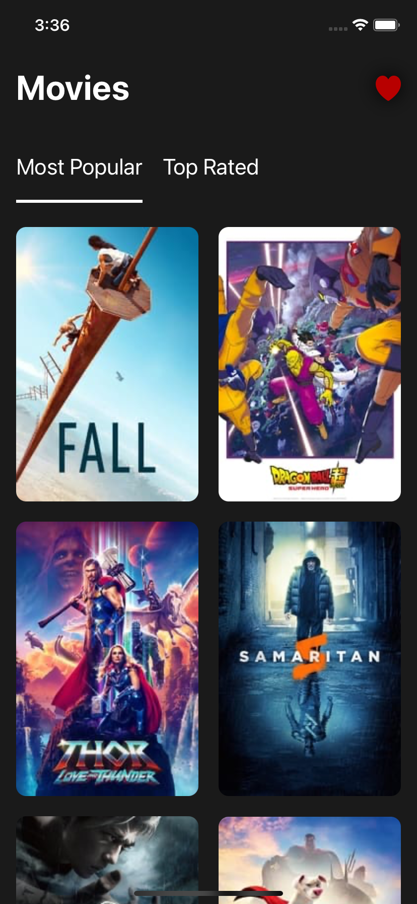
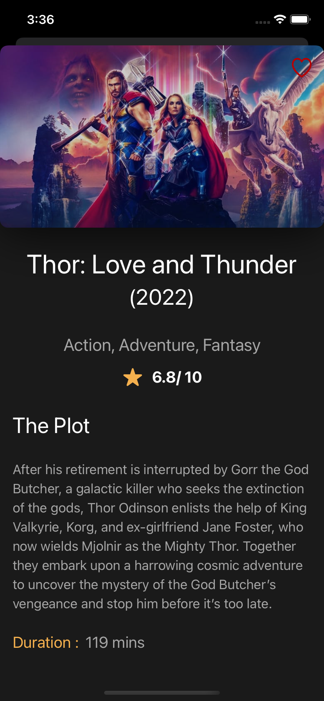

# CouchApp
Couch is an iOS app allows users to discover the most popular movies playing while they are sitting on the couch enjoying the movies with family and friends.

 

# Displaying Movies

Home screen displayed the most popular and top rated movies.
 
 

# Movie Details
Screen to display any movie more details (year of release, duration, plot ,...)
 
 

# Favorites Movies
User can select his Favorite movies and view it by clicking on heart button in Home Screen.

Home screen displayed the most popular and top rated movies.
 
 

# Technical details
**Architecture:** MVVM
 
 
**UI:** SwiftUI
 
 
**Language:** Swift
 
 
**Async:** Combine
